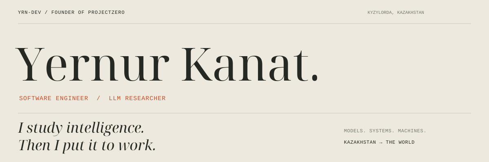
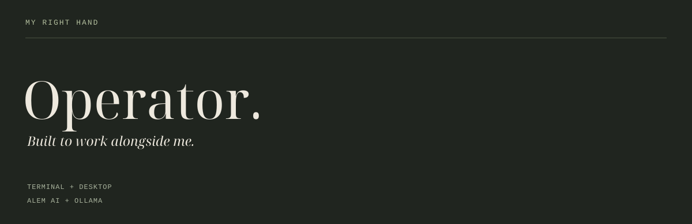

  

I work where **models become systems** — local inference, agent architecture, computer vision and the link between reasoning and action.

My first local model was **Mistral 7B on a laptop**. The limits of that machine became the beginning of my research. Now I build the tools I want to work with, and the systems I want to exist.

**Operator is my right hand.** The agent I build and work with — from research and code to execution. Tools, memory and a working environment, connected into one loop. I set the direction. We do the work.

  <a href="https://github.com/yrn-dev/Operator"><strong>Operator CLI ↗</strong></a> &nbsp; / &nbsp;
  <a href="https://github.com/yrn-dev/operator-desk"><strong>Operator Desktop ↗</strong></a>

---

**The ambition is global. The starting point is Kazakhstan.**

I’m building **ProjectZero** around a conviction: AI should make people more capable. That is the company I want to build — and the research I want to keep doing.

[The story so far](https://yernur.pzero.kz) &nbsp; · &nbsp; [Telegram](https://t.me/yernur_dev)
