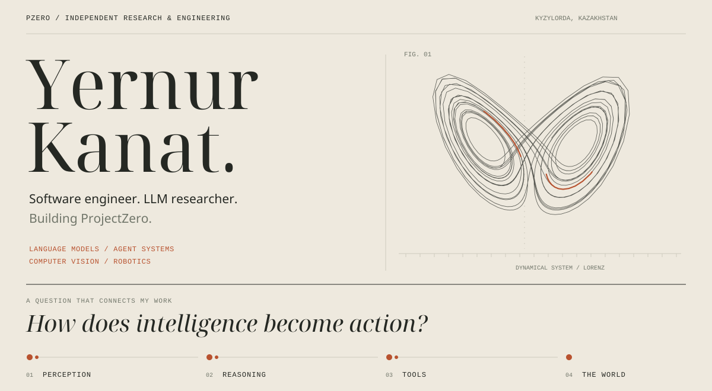
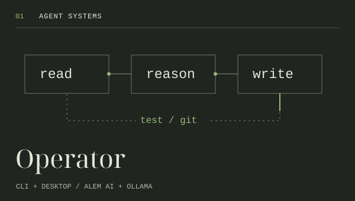
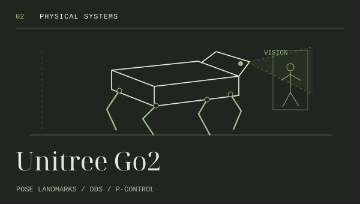
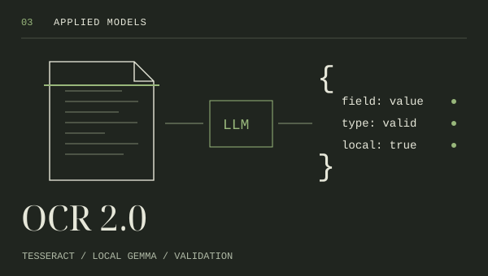

  

  <a href="https://yernur.pzero.kz">About me</a> &nbsp; / &nbsp;
  <a href="https://github.com/yrn-dev/Operator">Operator</a> &nbsp; / &nbsp;
  <a href="https://t.me/yernur_dev">Telegram</a>

I’m **Yernur Kanat**, a software engineer and LLM researcher from **Kyzylorda, Kazakhstan**, building **ProjectZero**.

I’m interested in the whole path from a model’s reasoning to a working system: local inference, tool use, software architecture, computer vision and robot control. My work ranges from terminal agents and desktop applications to document processing and experiments with physical interaction.

### Selected work

<table>
<tr>
<td width="33%" valign="top">

  
<strong>Language → tools</strong>  
A terminal coding agent built on <strong>pi</strong>, adapted for Alem AI and Ollama: file tools, shell execution, session history, task planning and memory. A separate desktop client talks to the agent over JSONL RPC.  
<a href="https://github.com/yrn-dev/Operator">CLI ↗</a> · <a href="https://github.com/yrn-dev/operator-desk">Desktop ↗</a>
</td>
<td width="33%" valign="top">

  
<strong>Perception → motion</strong>  
A documented vision-based companion project for Unitree Go2: MediaPipe pose landmarks, OpenCV, DDS communication and proportional control for following a person.  
<a href="https://github.com/yrn-dev/Unitree-Go2-Vision-Based-Autonomous-Follower">Project notes ↗</a> 
The public repository currently contains the project description, not the implementation.
</td>
<td width="33%" valign="top">

  
<strong>Documents → structured data</strong>  
A local pipeline combining image preprocessing, Tesseract, Gemma through Ollama and Python validation. Extracts fields from documents, with a Flask interface and export support.  
<a href="https://github.com/yrn-dev/OCR-2.0-">Source ↗</a>
</td>
</tr>
</table>

### Questions I work on

- **Models under real constraints.** Local inference, model size, quantization, and choosing models for the actual task.
- **Agents that can act.** How tool calls, memory, context and execution fit into a useful software system.
- **The perception–action loop.** Connecting visual observations to interfaces and robot control.

My starting point was running **Mistral 7B on my first laptop**. The limitations of that machine pushed me to understand inference, memory and quantization. Today I build the tools around models as well as the applications that use them. [More of the story →](https://yernur.pzero.kz)

### Elsewhere on the workbench

| Project | What I’m exploring |
| :--- | :--- |
| [ProjectZero MAS](https://github.com/yrn-dev/ProjectZero-MAS-) | A visual orchestration studio prototype: agent nodes, connections and a local Fastify backend. |
| [HBI Medical Analytics](https://github.com/yrn-dev/hbi-medical-analytics) | A healthcare analytics prototype with dashboards and Gemini-assisted reports in Kazakh. |
| [Music with Hand](https://github.com/yrn-dev/music-with-hand) | Real-time hand tracking as an interface for audio controls. |
| [Soyle Qyzylorda](https://github.com/yrn-dev/Soyle-Qyzylorda) | A Kazakh/Russian platform for local events and businesses. |

**Working tools:** Python · TypeScript / JavaScript · Linux · React · Electron · Flask · Fastify · OpenCV · MediaPipe · Ollama

---

**The direction behind ProjectZero:** build AI that helps people do better work, and build it from Kazakhstan.

The animated diagrams are illustrations of the ideas behind these projects, not live measurements. The cover traces a Lorenz attractor. All artwork is self-contained in this repository.
